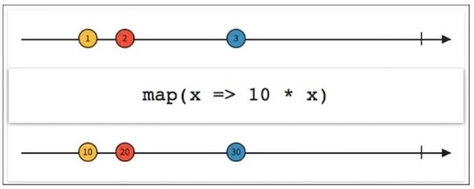

##RxJava系列三（原理）
> 转载请注明出处：

[RxJava系列1(简介)](http://www.jianshu.com/p/ec9849f2e510)  
[RxJava系列2(入门)](http://www.jianshu.com/p/ba61c047c230)  
[RxJava系列3(原理)]()  
<u>RxJava系列4(敬请期待)</u>  

***
前面两篇文章中我们介绍了RxJava的一些基本概念和RxJava最简单的用法。从这一章开始，我们开始聊聊RxJava中核心的API及其原理。

###Map系列API

RxJava提供了几个mapping函数：map()、flatMap()、concatMap()、flatMapIterable()以及switchMap()。所有这些函数都作用于一个可观测序列，然后变换它发射的值，最后用一种新的形式返回它们。
概念实在是不好理解，下面我们配合实际的例子一个个分别介绍。

**map()**

map()函数接受一个Func1类型的参数(就像这样`map(Func1<? super T, ? extends R> func)`),然后将这个func应用到每一个由Observable发射的值上。这种狗屁定义我相信你也听不懂，我们来看一张图：

上面这张图上Observable原本依次发送的值为1、2、3，经过map转换后就变成了10、20、30。

    Observable.just(1, 2, 3)
            .map(new Func1<Integer, Integer>() {
                @Override
                public Integer call(Integer integer) {
                    return integer * 10;
                }
            })
            .subscribe(new Action1<Integer>() {
                @Override
                public void call(Integer integer) {
                    System.out.println("value : " + integer);
                }
            });
            
 > Func1构造函数中的两个参数分别是Observable当前发射值当前的类型和map转换后的类型，上面这个例子中都是Integer

**flatMap()**

flatMap()函数同样也是做转换的，但是作用却不一样。flatMap不开好理解，我们直接看例子（我们公司是个房产平台，那我就拿房子举例）：假设我们有一组小区`Community[] communites`,现在我们要输出每个小区的名字；我们可以这样实现:

    Observable.from(communities)
            .map(new Func1<Community, String>() {

                @Override
                public String call(Community community) {
                    return community.name;
                }
            })
            .subscribe(new Action1<String>() {
                @Override
                public void call(String name) {
                    System.out.println("Community name : " + name);
                }
            });

现在我们需求有变化，需要打印出每个小区下面所有房子的价格。于是我可以这样实现：

   	Community[] communities = {};
    Observable.from(communities)
            .subscribe(new Action1<Community>() {
                @Override
                public void call(Community community) {
                    for (House house : community.houses) {
                        System.out.println("House price : " + house.price);
                    }
                }
            });
            
            
如果我不想在Subscriber中使用for循环，而是希望Subscriber中直接传入单个的House对象呢（这对于代码复用很重要）？用map()显然是不行的，因为map()是一对一的转化，而我现在的要求是一对多的转化。那么我们可以使用flatMap()把一个Community转化成多个House。
            

    Observable.from(communities)
            .flatMap(new Func1<Community, Observable<House>>() {
                @Override
                public Observable<House> call(Community community) {
                    return Observable.from(community.houses);
                }
            })
            .subscribe(new Action1<House>() {
                @Override
                public void call(House house) {
                    System.out.println("House price : " + house.price);
                }
            });
            
            
从前面的例子中你坑定发现了，flatMap()和map()都是把传入的参数转化之后返回另一个对象。但和map()不同的是，flatMap()中返回的是Observable对象，并且这个Observable对象并不是被直接发送到 Subscriber的回调方法中。

flatMap()的原理是这样的：

1. 将传入的事件对象装换成一个Observable对象；
2. 这是不会直接发送这个Observable, 而是将这个Observable激活让它自己开始发送事件；
3. 每一个创建出来的Observable发送的事件，都被汇入同一个Observable，这个Observable负责将这些事件统一交给Subscriber的回调方法。

这三个步骤，把事件拆成了两级，通过一组新创建的Observable将初始的对象『铺平』之后通过统一路径分发了下去。而这个『铺平』就是flatMap()所谓的flat。