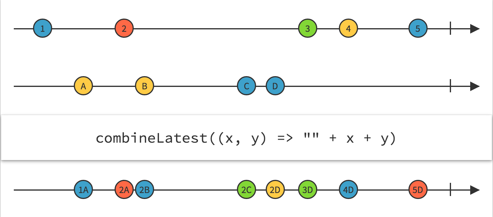

##RxJava系列五（组合操作符）
> 转载请注明出处：[http://www.jianshu.com/p/546fe44a6e22](http://www.jianshu.com/p/546fe44a6e22)

[RxJava系列1(简介)](http://www.jianshu.com/p/ec9849f2e510)  
[RxJava系列2(基本概念及使用介绍)](http://www.jianshu.com/p/ba61c047c230)  
[RxJava系列3(转换操作符)](http://www.jianshu.com/p/5970280703b9)  
[RxJava系列4(过滤操作符)](http://www.jianshu.com/p/3a188b995daa)  
[RxJava系列5(组合操作符)](http://www.jianshu.com/p/546fe44a6e22)     
<u>RxJava系列6(源码分析)</u>    
<u>RxJava系列7(最佳实践)</u> 

***
这一章我们接着介绍组合操作符，这类operators可以同时处理多个Observable来创建我们所需要的Observable。组合操作符主要包含： **`Merge`** **`StartWith`** **`Concat`** **`Zip`** **`CombineLatest`**  **`SwitchOnNext`** **`Join`**等等。

###Merge
**`merge(Observable, Observable)`**将两个Observable发射的事件序列组合并成一个事件序列，就像是一个Observable发射的一样。你可以简单的将它理解为两个Obsrvable合并成了一个Observable，合并后的数据是无序的。


我们看下面的例子，一共有两个Observable：一个用来发送字母，另一个用来发送数字；现在我们需要两连个Observable发射的数据合并。

```Java
String[] letters = new String[]{"A", "B", "C", "D", "E", "F", "G", "H"};
Observable<String> letterSequence = Observable.interval(300, TimeUnit.MILLISECONDS)
        .map(new Func1<Long, String>() {
            @Override
            public String call(Long position) {
                return letters[position.intValue()];
            }
        }).take(letters.length);

Observable<Long> numberSequence = Observable.interval(500, TimeUnit.MILLISECONDS).take(5);

Observable.merge(letterSequence, numberSequence)
        .subscribe(new Observer<Serializable>() {
            @Override
            public void onCompleted() {
                System.exit(0);
            }

            @Override
            public void onError(Throwable e) {
                System.out.println("Error:" + e.getMessage());
            }

            @Override
            public void onNext(Serializable serializable) {
                System.out.print(serializable.toString()+" ");
            }
        });   
```
            
程序输出：

```java
A 0 B C 1 D E 2 F 3 G H 4 
```

**`merge(Observable[])`**将多个Observable发射的事件序列组合并成一个事件序列，就像是一个Observable发射的一样。
![merge(Observable[])](MergeIOOperator.png)

###StartWith
**`startWith(T)`**用于在源Observable发射的数据前插入数据。使用**`startWith(Iterable<T>)`**我们还可以在源Observable发射的数据前插入Iterable。官方示意图：


**`startWith(Observable<T>)`**用于在源Observable发射的数据前插入另一个Observable发射的数据（这些数据会被插入到
源Observable发射数据的前面）。官方示意图：


###Concat
**`concat(Observable<? extends T>, Observable<? extends T>)`** **`concat(Observable<？ extends Observable<T>>`)**用于将多个obserbavle发射的的数据进行合并发射，concat严格按照顺序发射数据，前一个Observable没发射玩是不会发射后一个Observable的数据的。它和merge、startWitch和相似，不同之处在于：

1. merge:合并后发射的数据是无序的；
2. startWitch:只能在源Observable发射的数据前插入数据。


这里我们将前面Merge操作符的例子拿过来，并将操作符换成`Concat`，然后我们看看执行结果：

```java
    String[] letters = new String[]{"A", "B", "C", "D", "E", "F", "G", "H"};
    Observable<String> letterSequence = Observable.interval(300, TimeUnit.MILLISECONDS)
            .map(new Func1<Long, String>() {
                @Override
                public String call(Long position) {
                    return letters[position.intValue()];
                }
            }).take(letters.length);

    Observable<Long> numberSequence = Observable.interval(500, TimeUnit.MILLISECONDS).take(5);

    Observable.concat(letterSequence, numberSequence)
            .subscribe(new Observer<Serializable>() {
                @Override
                public void onCompleted() {
                    System.exit(0);
                }

                @Override
                public void onError(Throwable e) {
                    System.out.println("Error:" + e.getMessage());
                }

                @Override
                public void onNext(Serializable serializable) {
                    System.out.print(serializable.toString() + " ");
                }
            });
```
          
程序输出：

```java
	A B C D E F G H 0 1 2 3 4 
```

###Zip
**`zip(Observable, Observable, Func2)`**用来合并两个Observable发射的数据项，根据Func2函数生成一个新的值并发射出去。当其中一个Observable发送数据结束或者出现异常后，另一个Observable也将停在发射数据。


和前面的例子一样，我们将操作符换成了`zip`:

    String[] letters = new String[]{"A", "B", "C", "D", "E", "F", "G", "H"};
    Observable<String> letterSequence = Observable.interval(120, TimeUnit.MILLISECONDS)
            .map(new Func1<Long, String>() {
                @Override
                public String call(Long position) {
                    return letters[position.intValue()];
                }
            }).take(letters.length);

    Observable<Long> numberSequence = Observable.interval(200, TimeUnit.MILLISECONDS).take(5);

    Observable.zip(letterSequence, numberSequence, new Func2<String, Long, String>() {
        @Override
        public String call(String letter, Long number) {
            return letter + number;
        }
    }).subscribe(new Observer<String>() {
        @Override
        public void onCompleted() {
            System.exit(0);
        }

        @Override
        public void onError(Throwable e) {
            System.out.println("Error:" + e.getMessage());
        }

        @Override
        public void onNext(String result) {
            System.out.print(result + " ");
        }
    });
    
程序输出：

	A0 B1 C2 D3 E4

###CombineLatest
**`comnineLatest(Observable, Observable, Func2)`**用于将两个Observale最近发射的数据已经Func2函数的规则进展组合。下面是官方提供的原理图：


下面这张图应该更容易理解：


    List<String> communityNames = DataSimulator.getCommunityNames();
    List<Location> locations = DataSimulator.getLocations();

    Observable<String> communityNameSequence = Observable.interval(1, TimeUnit.SECONDS)
            .map(new Func1<Long, String>() {
                @Override
                public String call(Long position) {
                    return communityNames.get(position.intValue());
                }
            }).take(communityNames.size());
    Observable<Location> locationSequence = Observable.interval(1, TimeUnit.SECONDS)
            .map(new Func1<Long, Location>() {
                @Override
                public Location call(Long position) {
                    return locations.get(position.intValue());
                }
            }).take(locations.size());

    Observable.combineLatest(
            communityNameSequence,
            locationSequence,
            new Func2<String, Location, String>() {
                @Override
                public String call(String communityName, Location location) {
                    return "小区名:" + communityName + ", 经纬度:" + location.toString();
                }
            }).subscribe(new Observer<String>() {
                @Override
                public void onCompleted() {
                    System.exit(0);
                }

                @Override
                public void onError(Throwable e) {
                    System.out.println("Error:" + e.getMessage());
                }

                @Override
                public void onNext(String s) {
                    System.out.println(s);
                }
            });
            
程序输出：

	小区名:竹园新村, 经纬度:(21.827, 23.323)
	小区名:康桥半岛, 经纬度:(21.827, 23.323)
	小区名:康桥半岛, 经纬度:(11.923, 16.309)
	小区名:中粮·海景壹号, 经纬度:(11.923, 16.309)
	小区名:中粮·海景壹号, 经纬度:(22.273, 53.623)
	小区名:浦江名苑, 经纬度:(22.273, 53.623)
	小区名:南辉小区, 经纬度:(22.273, 53.623)


###SwitchOnNext
**`switchOnNext(Observable<? extends Observable<? extends T>>`**用来将一个发射多个小Observable的源Observable转化为一个Observable，然后发射这多个小Observable所发射的数据。如果一个小的Observable正在发射数据的时候，源Observable又发射出一个新的小Observable，则前一个Observable发射的数据会被抛弃，直接发射新
的小Observable所发射的数据。

结合下面的原理图大家应该很容易理解，我们可以看到下图中的黄色圆圈就被丢弃了。


###Join
**`join(Observable, Func1, Func1, Func2)`**我们先介绍下join操作符的4个参数：

* Observable：源Observable需要组合的Observable,这里我们姑且称之为目标Observable；
* Func1：接收从源Observable发射来的数据，并返回一个Observable，这个Observable的声明周期决定了源Obsrvable发射出来的数据的有效期；
* Func1：接收目标Observable发射来的数据，并返回一个Observable，这个Observable的声明周期决定了目标Obsrvable发射出来的数据的有效期；
* Func2：接收从源Observable和目标Observable发射出来的数据，并将这两个数据组合后返回。

所以Join操作符的语法结构大致是这样的：**`onservableA.join(observableB, 控制observableA发射数据有效期的函数， 控制observableB发射数据有效期的函数，两个observable发射数据的合并规则)`**

join操作符的效果类似于排列组合，把第一个数据源A作为基座窗口，他根据自己的节奏不断发射数据元素，第二个数据源B，每发射一个数据，我们都把它和第一个数据源A中已经发射的数据进行一对一匹配；举例来说，如果某一时刻B发射了一个数据“B”,此时A已经发射了0，1，2，3共四个数据，那么我们的合并操作就会把“B”依次与0,1,2,3配对，得到四组数据： `[0, B]` `[1, B]` `[2, B]` `[3, B]`

再看看下面的图是不是好理解了呢？！


读懂了上面的文字，我们再来写段代码加深理解。

    final List<House> houses = DataSimulator.getHouses();//模拟的房源数据，用于测试

    //用来每秒从houses总取出一套房源并发射出去
    Observable<House> houseSequence =
            Observable.interval(1, TimeUnit.SECONDS)
                    .map(new Func1<Long, House>() {
                        @Override
                        public House call(Long position) {
                            return houses.get(position.intValue());
                        }
                    }).take(houses.size());//这里的take是为了防止houses.get(position.intValue())数组越界

    //用来实现每秒发送一个新的Long型数据
    Observable<Long> tictoc = Observable.interval(1, TimeUnit.SECONDS);

    houseSequence.join(tictoc,
            new Func1<House, Observable<Long>>() {
                @Override
                public Observable<Long> call(House house) {
                    return Observable.timer(2, TimeUnit.SECONDS);
                }
            },
            new Func1<Long, Observable<Long>>() {
                @Override
                public Observable<Long> call(Long aLong) {
                    return Observable.timer(0, TimeUnit.SECONDS);
                }
            },
            new Func2<House, Long, String>() {
                @Override
                public String call(House house, Long aLong) {
                    return aLong + "-->" + house.getDesc();
                }
            }
    ).subscribe(new Observer<String>() {
        @Override
        public void onCompleted() {
            System.exit(0);
        }

        @Override
        public void onError(Throwable e) {
            System.out.println("Error:"+e.getMessage());
        }

        @Override
        public void onNext(String s) {
            System.out.println(s);
        }
    });

程序输出：

	0-->中粮海景壹号新出大平层！总价4500W起
	1-->中粮海景壹号新出大平层！总价4500W起
	1-->满五唯一，黄金地段
	2-->中粮海景壹号新出大平层！总价4500W起
	2-->满五唯一，黄金地段
	2-->一楼自带小花园
	3-->一楼自带小花园
	3-->毗邻汤臣一品
	4-->毗邻汤臣一品
	4-->顶级住宅，给您总统般尊贵体验
	5-->顶级住宅，给您总统般尊贵体验
	5-->顶层户型，两室一厅
	6-->顶层户型，两室一厅
	6-->南北通透，豪华五房
	7-->南北通透，豪华五房
	
通过[转换操作符](http://www.jianshu.com/p/5970280703b9)、[过滤操作符](http://www.jianshu.com/p/3a188b995daa)、[组合操作符](http://www.jianshu.com/p/546fe44a6e22)三个篇幅将RxJava主要的操作符也介绍的七七八八了。更多操作符的介绍建议大家去查阅官方文档，并自己动手实践一下。这一系列的文章也会持续更新，欢迎大家保持关注！:)

Demo源码地址：[https://github.com/BaronZ88/HelloRxJava](https://github.com/BaronZ88/HelloRxJava)


