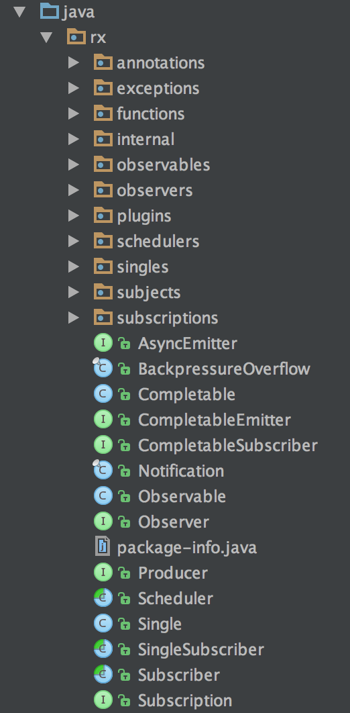

#RxJava系列7(从宏观角度解读RxJava源码)
> 转载请注明出处：

* [RxJava系列1(简介)](https://zhuanlan.zhihu.com/p/20687178)
* [RxJava系列2(基本概念及使用介绍)](https://zhuanlan.zhihu.com/p/20687307)
* [RxJava系列3(转换操作符)](https://zhuanlan.zhihu.com/p/21926591)
* [RxJava系列4(过滤操作符)](https://zhuanlan.zhihu.com/p/21966621)
* [RxJava系列5(组合操作符)](https://zhuanlan.zhihu.com/p/22039934)
* [RxJava系列6(从微观角度解读RxJava源码)](https://zhuanlan.zhihu.com/p/22338235)   
* [RxJava系列7(从宏观角度解读RxJava源码)]()  
* <u>RxJava系列8(最佳实践)</u>  

***

##前言

上一篇中我们从`RxJava基本流程`、`操作符`、`线程调度`三个方面分析了RxJava的实现，梳理了RxJava的执行流程。而本篇我们将站在宏观的角度分析整个RxJava的框架结构和设计思想。

> 本章节基于**RxJava1.1.9**版本的源码

##项目结构介绍

我们先来看下RxJava的包结构：

	

***

> 如果大家喜欢这一系列的文章，欢迎关注我的知乎专栏、GitHub、简书博客。
>   
> * 知乎专栏：[https://zhuanlan.zhihu.com/baron](https://zhuanlan.zhihu.com/baron)  
> * GitHub：[https://github.com/BaronZ88](https://github.com/BaronZ88)  
> * 简书博客：[http://www.jianshu.com/users/cfdc52ea3399](http://www.jianshu.com/users/cfdc52ea3399) 

