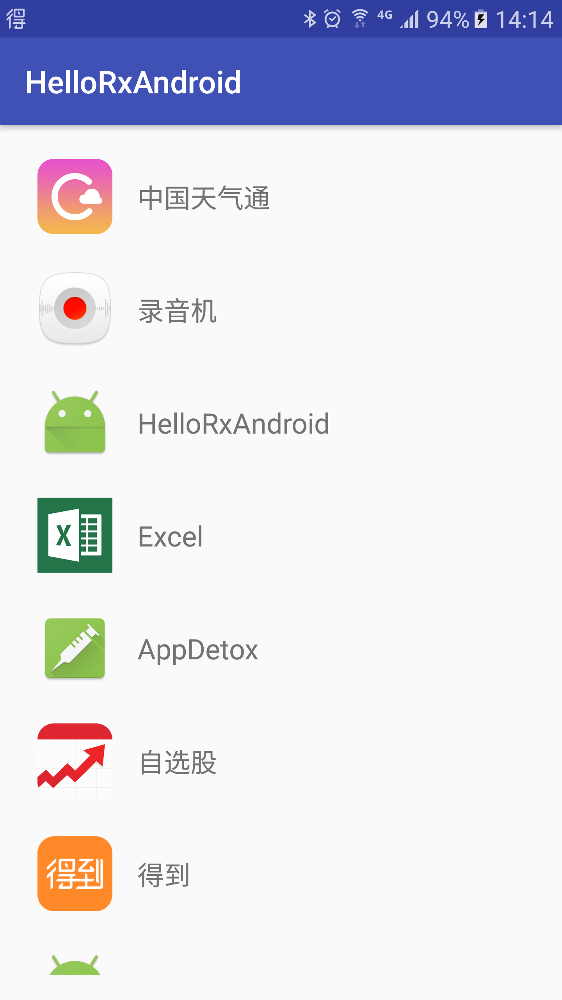

#RxJava系列8(最佳实践)
> 转载请注明出处：[]()

* [RxJava系列1(简介)](https://zhuanlan.zhihu.com/p/20687178)
* [RxJava系列2(基本概念及使用介绍)](https://zhuanlan.zhihu.com/p/20687307)
* [RxJava系列3(转换操作符)](https://zhuanlan.zhihu.com/p/21926591)
* [RxJava系列4(过滤操作符)](https://zhuanlan.zhihu.com/p/21966621)
* [RxJava系列5(组合操作符)](https://zhuanlan.zhihu.com/p/22039934)
* [RxJava系列6(从微观角度解读RxJava源码)](https://zhuanlan.zhihu.com/p/22338235)   
* [RxJava系列7(从宏观角度解读RxJava源码)]()  
* [RxJava系列8(最佳实践)]()  

***

##前言

有点标题党了，其实也谈不上什么最佳实践。最近公司实行996，时间和精力有限，因此这篇文章只是简单了介绍了下RxJava在生产环境中的使用。不过本篇中的每个例子我都配上了完整的代码

原计划这一期是要介绍RxJava框架结构和设计思想的，但是考虑到Netflix将在十月底发布RxJava2.0正式版(加上万恶的996...)，精力有限；因此决定将RxJava框架结构和设计思想分析放到2.0正式版发布后再做。后续我也会有一系列的文章来介绍RxJava1.x和2.x的区别。

## 示例一、获取手机上已安装的App

第一个例子我们需要在Android设备上展示已安装的第三方app列表，关于环境搭建、依赖配置、RecyclerView的使用等这些基础内容我就不做陈述了。需要了解的同学可以去GitHub上把项目clone下来看看。这里我主要讲讲如何通过RxJava实现核心功能。

首选我们需要调用系统api来获取所有已安装的app，所以在`OnSubscribe`的`call`方法中调用`getApplicationInfoList()`。但是`getApplicationInfoList()`获取的数据并不能完全满足我们的业务需求：

1. 由于我们只需要展示手机上已安装的第三方App，因此需要通过`filter`操作符来过滤掉系统app；
2. `ApplicationInfo`并不是我们所需要的类型，因此需要通过`map`操作符将其转换为`AppInfo`；
3. 由于获取`ApplicationInfo`、过滤数据、转换数据相对比较耗时，因此需要通过`subscribeOn`操作符将这一系列操作放到子线程中来处理；
4. 而要将信息展示在页面上涉及到UI操作，因此需要通过`observeOn`操作符将`onNext`、`onCompleted`、`onError`调度到主线程，接着我们在这些方法中更新UI。

下面是核心代码：

```java
final PackageManager pm = MainActivity.this.getPackageManager();
Observable.create(new Observable.OnSubscribe<ApplicationInfo>() {
        @Override
        public void call(Subscriber<? super ApplicationInfo> subscriber) {
            List<ApplicationInfo> infoList = getApplicationInfoList(pm);
            for (ApplicationInfo info : infoList) {
                subscriber.onNext(info);
            }
            subscriber.onCompleted();
        }
    }).filter(new Func1<ApplicationInfo, Boolean>() {
        @Override
        public Boolean call(ApplicationInfo applicationInfo) {
            return (applicationInfo.flags & ApplicationInfo.FLAG_SYSTEM) <= 0;
        }
    }).map(new Func1<ApplicationInfo, AppInfo>() {

        @Override
        public AppInfo call(ApplicationInfo applicationInfo) {
            AppInfo info = new AppInfo();
            info.setAppIcon(applicationInfo.loadIcon(pm));
            info.setAppName(applicationInfo.loadLabel(pm).toString());
            return info;
        }
    }).subscribeOn(Schedulers.io())
    .observeOn(AndroidSchedulers.mainThread())
    .subscribe(new Subscriber<AppInfo>() {
        @Override
        public void onCompleted() {
            mAppListAdapter.notifyDataSetChanged();
            mPullDownSRL.setRefreshing(false);
        }

        @Override
        public void onError(Throwable e) {
            mPullDownSRL.setRefreshing(false);
        }

        @Override
        public void onNext(AppInfo appInfo) {
            mAppInfoList.add(appInfo);
        }
    });
```
程序执行效果图：

<div align="left">
	
</div>

完整的代码我放到了GitHub上，有兴趣大家可以去clone下来自己运行看看。

源码地址：[https://github.com/BaronZ88/HelloRxAndroid](https://github.com/BaronZ88/HelloRxAndroid)

## 示例二、RxJava+Retrofit2实现获取天气数据

RxJava+Retrofit2几乎是Android应用开发的标配了，这个例子中我们就来聊聊这二者是如何配合起来帮助我们快速开发的。

Retrofit中一个标准的接口定义是这样的：

```java
@GET("weather")
Observable<MiWeather> getMiWeather(@Query("cityId") String cityId);
```


上面的实例代码均出自：[https://github.com/BaronZ88/WeatherStyle](https://github.com/BaronZ88/WeatherStyle)

> [WeatherStyle]((https://github.com/BaronZ88/WeatherStyle))这个项目还在开发中，这个项目不只包含了RxJava和Retrofit的使用，同时还包含MVP、ORMLite、RetroLambda、ButterKnife等等开源库的使用

***

> 如果大家喜欢这一系列的文章，欢迎关注我的知乎专栏、GitHub、简书博客。
>   
> * 知乎专栏：[https://zhuanlan.zhihu.com/baron](https://zhuanlan.zhihu.com/baron)  
> * GitHub：[https://github.com/BaronZ88](https://github.com/BaronZ88)  
> * 简书博客：[http://www.jianshu.com/users/cfdc52ea3399](http://www.jianshu.com/users/cfdc52ea3399) 


