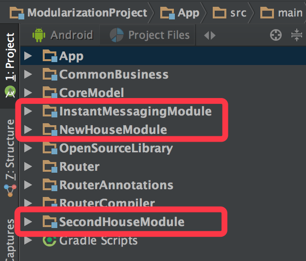
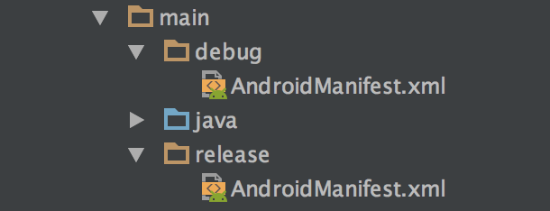

# Android 模块化探索与实践

## 前言

万维网发明人 Tim Berners-Lee 谈到设计原理时说过：“简单性和模块化是软件工程的基石；分布式和容错性是互联网的生命。” 由此可见模块化之于软件工程领域的重要性。

从16年开始，模块化在 Android 社区越来越多的被提及。随着移动平台的不断发展，移动平台上的软件体积也变得臃肿庞大，为了降低大型软件复杂性和耦合度，同时也为了适应模块重用、多团队并行开发测试等等因素，模块化在 Android 平台上变得势在必行。阿里 Android 团队在年初开源了他们的容器化框架 Atlas 就很大程度说明了当前 Android 平台开发大型商业项目所面临更的问题。

## 什么是模块化

那么什么是模块化呢？《 Java 应用架构设计：模块化模式与 OSGi 》一书中对它的定义是：模块化是一种处理复杂系统分解为更好的可管理模块的方式。

上面这种描述太过生涩难懂，不够直观。下面这种类比的方式则可能加容易理解。

我们可以把软件看做是一辆汽车，开发一款软件的过程就是生产一辆汽车的过程。一辆汽车是由车架、发动机、变数箱、车轮等一系列模块组成的。

这些模块是由不同的工厂生产的，一辆 BMW 的发动机可能是由位于德国的工厂生产的，它的自动变数箱可能是 Jatco（世界三大变速箱厂商之一）位于日本的工厂生产的，车轮可能是中国的工厂的生产的，最后交给华晨宝马的工厂统一组装成一辆完整的汽车。这就类似于我们在软件工程领域里说的多团队并行开发，最后将各个团队开发的模块统一打包成我们可使用的 App 。

一款发动机、一款变数箱都不可能只应用于一个车型，比如同一款 Jatco 的自动变速箱即可能被安装在 BMW 的车型上，也可能被安装在 Mazda 的车型上。这就如同软件开发领域里的模块重用。

到了冬天，我们需要将汽车的公路胎升级为雪地胎，轮胎可以很轻易的更换。这就是低耦合，一个模块的升级替换不会影响到其它模块，也不会受其它模块的限制；同时这也类似于我们在软件开发领域提到的可插拔。

## 模块化分层设计

上面的类比很清晰的说明的模块化带来的好处：

* 多团队并行开发测试；
* 模块间解耦、重用；
* 可单独编译打包某一模块，提升开发效率。

在[《安居客 Android 项目架构演进》](https://zhuanlan.zhihu.com/p/25420181)这篇文章中，我介绍了安居客 Android 端的模块化设计方案，这里我还是拿它来举例。但首先要对本文中的**组件**和**模块**做个区别定义

* **组件**：指的是单一的功能组件，如地图组件（MapSDK）、支付组件（AnjukePay）、路由组件（Router）等等；

* **模块**：指的是独立的业务模块，如新房模块（NewHouseModule）、二手房模块（SecondHouseModule）、即时通讯模块（InstantMessagingModule）等等；模块相对于组件来说粒度更大。

具体设计方案如下图：


从下至上依次为*基础组件层（包含各种基础组件）*、*业务组件层（和业务相关的组件）*、*业务模块层（各业务模块）*。我们在谈模块化的时候，其实就是将业务模块层的各个功能业务拆分层独立的业务模块。

所以我们进行模块化的第一步就是业务模块划分，但是模块划分并没有一个业界通用的标准，因此划分的粒度需要根据项目情况进行合理把控，这就需要对业务和项目有较为透彻的理解。拿安居客来举例，我们会将项目划分为新房模块、二手房模块、IM 模块等等。

每个业务模块在 Android Studio 中的都是一个 Module ,因此在命名方面我们要求每个业务模块都以 Module 为后缀。如下图所示：<div align="left"></div>

对于模块化项目，每个单独的 Business Module 都可以单独编译成 APK。在开发阶段需要单独打包编译，项目发布的时候又需要它作为项目的一个 Module 来整体编译打包。简单的说就是开发时是 Application，发布时是 Library。因此需要你在 Business Module 的 build.gradle 中加入如下代码：

```groovy
if(isBuildModule.toBoolean()){
    apply plugin: 'com.android.application'
}else{
    apply plugin: 'com.android.library'
}
```

同样 Manifest.xml 也需要有两套：

```groovy
sourceSets {
   main {
       if (isBuildModule.toBoolean()) {
           manifest.srcFile 'src/main/debug/AndroidManifest.xml'
       } else {
           manifest.srcFile 'src/main/release/AndroidManifest.xml'
       }
   }
}
```

如图：<div align="left"></div>

debug 模式下的 AndroidManifest.xml :

```xml
<?xml version="1.0" encoding="utf-8"?>
<manifest xmlns:android="http://schemas.android.com/apk/res/android"
    package="com.baronzhang.android.newhouse">

    <application
        android:allowBackup="true"
        android:icon="@mipmap/new_house_ic_launcher"
        android:label="@string/new_house_app_name"
        android:supportsRtl="true"
        android:theme="@style/NewHouseAppTheme">
        <activity
            android:name="com.baronzhang.android.newhouse.NewHouseMainActivity"
            android:label="@string/new_house_label_home_page">
            <intent-filter>
                <action android:name="android.intent.action.MAIN" />
                <category android:name="android.intent.category.LAUNCHER" />
            </intent-filter>
        </activity>

    </application>

</manifest>
```

realease 模式下的 AndroidManifest.xml :

```xml
<?xml version="1.0" encoding="utf-8"?>
<manifest xmlns:android="http://schemas.android.com/apk/res/android"
    package="com.baronzhang.android.newhouse">

    <application
        android:allowBackup="true"
        android:supportsRtl="true">
        <activity
            android:name="com.baronzhang.android.newhouse.NewHouseMainActivity"
            android:label="@string/new_house_label_home_page">
            <intent-filter>
                <category android:name="android.intent.category.DEFAULT" />
                <category android:name="android.intent.category.BROWSABLE" />

                <action android:name="android.intent.action.VIEW" />
                <data
                    android:host="com.baronzhang.android.newhouse"
                    android:scheme="router" />
            </intent-filter>
        </activity>

    </application>

</manifest>
```

## 模块间跳转通讯 ([Router](https://github.com/BaronZ88/Router))

对业务进行模块化拆分后，为了使各业务模块间解耦，因此各个 Bussiness Module 都是独立的模块，它们之间是没有依赖关系。那么各个模块间的跳转通讯如何实现呢？

如果业务上要求从**新房的列表页**跳转到**二手房的列表页**，那么由于是 NewHouseModule 和 SecondHouseModule 之间并不相互依赖，我们通过想如下这种方式实现 Activity 跳转显然是不可能的实现的。

```Java
Intent intent = new Intent(NewHouseListActivity.this, SecondHouseListActivity.class);
startActivity(intent);
```

有的同学可能会想到用显示跳转来实现：

```
Intent intent = new Intent(Intent.ACTION_VIEW, "<scheme>://<host>:<port>/<path>");
startActivity(intent);
```

但是这种代码写起来比较繁琐，且容易出错，出错也不太容易定位问题。因此一个简单易用、解放开发的路由框架是必须的了。我自己实现的路由框架分为 **路由（Router）**和 **参数注入器（Injector）**两部分：<div align="left"></div>

### Router

路由（Router）部分通过 Java 注解结合动态代理来实现，这一点和 Retrofit 的实现原理是一样的。

首先需要定义我们自己的注解（篇幅有限，这里只列出少部分源码）。

用于定义跳转 URI 的注解 FullUri：

```java
@Documented
@Target(ElementType.METHOD)
@Retention(RetentionPolicy.RUNTIME)
public @interface FullUri {

    //完整的Intent URI
    String value();
}
```

用于定义跳转传参的 UriParam（ UriParam 注解的参数用于拼接到 URI 后面）：

```java
@Documented
@Target(ElementType.PARAMETER)
@Retention(RetentionPolicy.RUNTIME)
public @interface UriParam {

    String value();
}
```

用于定义跳转传参的 IntentExtrasParam（ IntentExtrasParam 注解的参数最终通过 Intent 来传递）：

```java
@Documented
@Target(ElementType.PARAMETER)
@Retention(RetentionPolicy.RUNTIME)
public @interface IntentExtrasParam {

    String value();
}
```

然后实现 Router ,内部通过动态代理的方式来实现 Activity 跳转：

```java
public final class Router {

    private Context context;

    public Router(Context context) {
        this.context = context;
    }

    public <T> T create(final Class<T> service) {

        return (T) Proxy.newProxyInstance(service.getClassLoader(), new Class[]{service}, new InvocationHandler() {
            @Override
            public Object invoke(Object proxy, Method method, Object[] args) throws Throwable {

                StringBuilder urlBuilder = new StringBuilder();

                FullUri fullUri = method.getAnnotation(FullUri.class);
                CombinationUri combinationUri = method.getAnnotation(CombinationUri.class);

                if (fullUri != null) {
                    urlBuilder.append(fullUri.value());
                } else {
                    throw new IllegalArgumentException("");
                }

                Annotation[][] parameterAnnotations = method.getParameterAnnotations();//获取注解参数

                HashMap<String, Object> serializedParams = new HashMap<>();

					  //拼接跳转 URI
                int position = 0;
                for (int i = 0; i < parameterAnnotations.length; i++) {
                    Annotation[] annotations = parameterAnnotations[i];
                    if (annotations == null || annotations.length == 0)
                        break;

                    Annotation annotation = annotations[0];
                    if (annotation instanceof UriParam) {
                        urlBuilder.append(position == 0 ? "?" : "&");
                        position++;
                        UriParam uriParam = (UriParam) annotation;
                        urlBuilder.append(uriParam.value()).append("=").append(args[i]);
                    } else if (annotation instanceof IntentExtrasParam) {
                        IntentExtrasParam intentExtrasParam = (IntentExtrasParam) annotation;
                        serializedParams.put(intentExtrasParam.value(), args[i]);
                    }
                }

                //执行Activity跳转操作
                performJump(urlBuilder.toString(), serializedParams);
                return null;
            }
        });
    }
	...
```

上面是 Router 实现的部分代码，在使用 Router 来跳转的时候，首先需要定义一个 Interface（类似于 Retrofit 的使用方式）：

```java
public interface RouterService {

    @FullUri("router://com.baronzhang.android.router.FourthActivity")
    void startUserActivity(@UriParam("cityName") String cityName, @IntentExtrasParam("user") User user);
    
}
```

接下来我们就可以通过如下方式实现 Activity 的跳转传参了：

```java
 User user = new User("张三", 17, 165, 88);
 routerService.startUserActivity("上海", user);
```

### Injector

参数注入器（Injector）部分通过 Java 编译时注解来实现，实现思路和 ButterKnife 这类编译时注解框架类似。

首先定义我们的参数注解 InjectUriParam ：

```java
@Documented
@Target(ElementType.FIELD)
@Retention(RetentionPolicy.CLASS)
public @interface InjectUriParam {
    String value() default "";
}
```

然后实现一个注解处理器 InjectProcessor ，在编译阶段生成获取参数的代码：

```java
@AutoService(Processor.class)
public class InjectProcessor extends AbstractProcessor {

    ...

    @Override
    public boolean process(Set<? extends TypeElement> set, RoundEnvironment roundEnvironment) {

        //解析注解
        Map<TypeElement, TargetClass> targetClassMap = findAndParseTargets(roundEnvironment);

        //解析完成后，生成的代码的结构已经有了，它们存在InjectingClass中
        for (Map.Entry<TypeElement, TargetClass> entry : targetClassMap.entrySet()) {

            TypeElement typeElement = entry.getKey();
            TargetClass targetClass = entry.getValue();

            JavaFile javaFile = targetClass.brewJava();
            try {
                javaFile.writeTo(filer);
            } catch (IOException e) {
                error(typeElement, "Unable to write injecting for type %s: %s", typeElement, e.getMessage());
            }
        }
        return false;
    }
    
    ...
}
```

使用方式类似于 ButterKnife ，在 Activity 中我们使用 Inject 来注解一个全局变量：

```java
@Inject User user;
```

然后 onCreate 方法中需要调用 inject(Activity activity) 方法实现注入：

```java
RouterInjector.inject(this);
```

这样我们就可以获取到前面通过 Router 跳转的传参了。

> 由于篇幅限制，加上为了便于理解，这里只贴出了极少部分 [Router](https://github.com/BaronZ88/Router) 框架的源码。希望进一步了解 Router 实现原理的可以到 GiuHub 去翻阅源码，[Router](https://github.com/BaronZ88/Router) 的实现还比较简陋，后面会进一步完善功能和文档，之后也会有单独的文章详细介绍。源码地址：[https://github.com/BaronZ88/Router](https://github.com/BaronZ88/Router)

## 遇到的问题

### 各组件、模块的依赖管理

### 业务耦合

### 模块化过程中的建议


