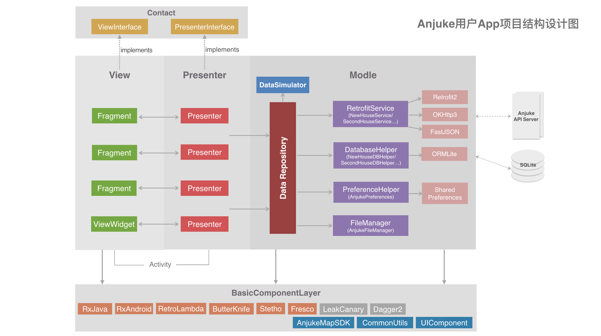
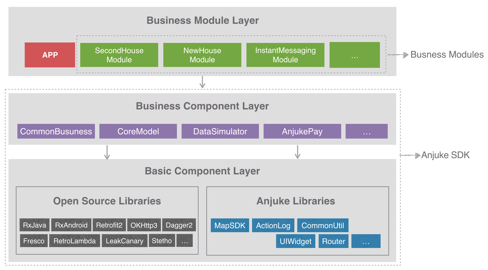
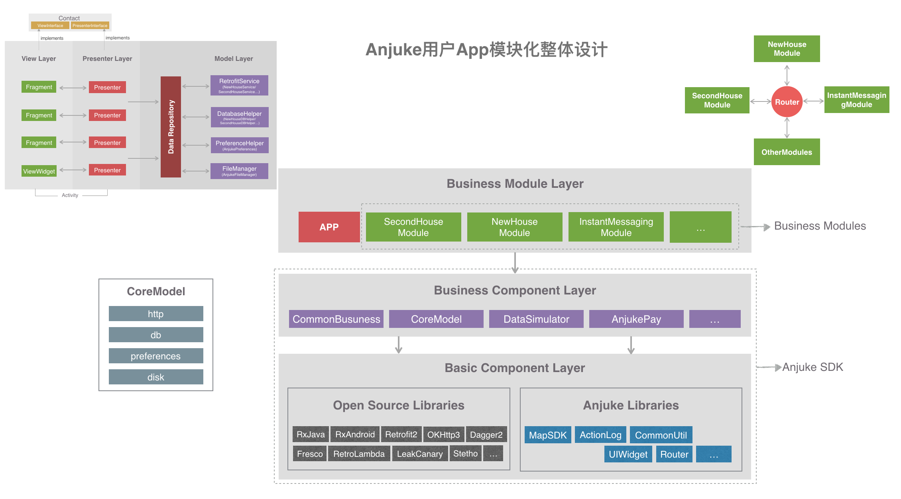
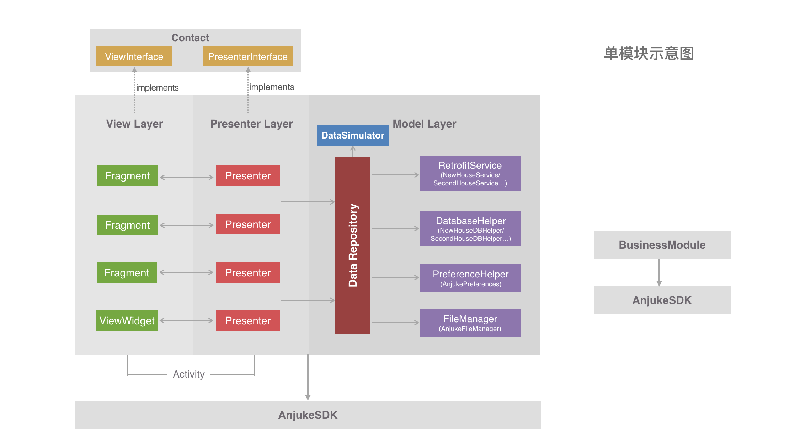

# 安居客Android项目架构演进

入职安居客三年多，从一个只需要完成功能模块的工程师到现在成为Android团队Team Leader，见证了Android端一路走来的发展历程。因此有心将这些记录下来与大家分享，也算是对自己三年来的工作总结吧。希望对大家有所帮助，更希望能得到大家宝贵的建议。

## 1. 过去：三网合并留下的烂摊子

## 2. 现在：由RxJava驱动的MVP架构

## 3. 下一步：组件化与模块化(进行中)

### 3.1. 组件化

### 3.2. 模块化

#### 3.2.1 模块化的目的

* 组件间、业务模块间解耦
* 单个业务模块单独编译打包，加快编译速度
* 多团队间并行开发、测试
* 解决好租App需要维护的问题，降低研发成本
* 避免多团队重复造轮子

#### 3.2.2 模块化规范

* 单一业务组件只能对应某一项具体的业务，对于有个性化需求的对外部提供接口让调用方定制
* 合理控制各组件和各业务模块的拆分粒度，太小的公有模块不足以构成单独组件或者模块的，我们先放到类似于CommonBusuness的组件中，在后期不断的重构迭代中视情况进行进一步的拆分
* 各业务模块之间的通讯使用隐式的Intent来实现（后面我们可以开发自己的路由框架Router）
* 各Layer间严禁反向依赖，横向依赖关系由各业务leader和技术小组商讨决定

