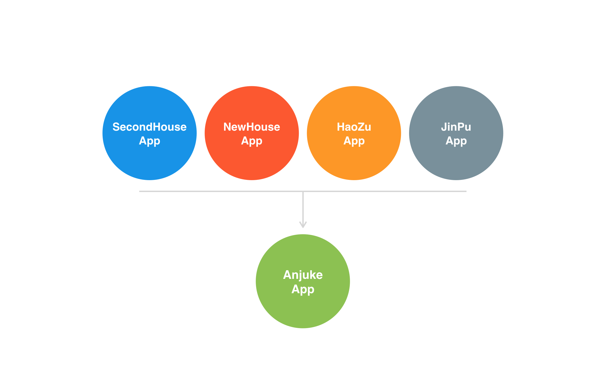
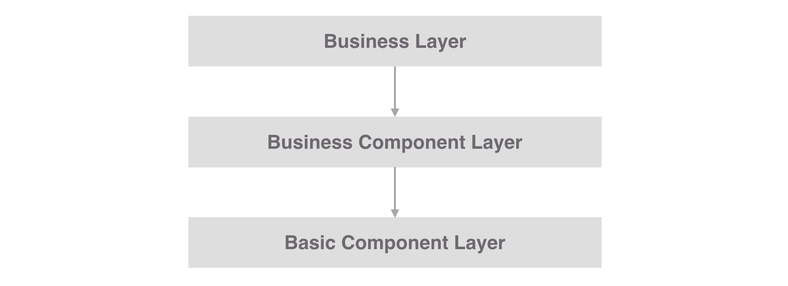

# 安居客Android项目架构演进（草稿）

入职安居客三年多，从一个只需要完成功能模块的工程师到现在成为Android团队Team Leader，见证了Android端一路走来的发展历程。因此有心将这些记录下来与大家分享，也算是对自己三年来的工作总结吧。希望对大家有所帮助，更希望能得到大家宝贵的建议。

## 1. 过去：三网合并留下的烂摊子

三年前入职安居客的时候，安居客在业务上刚完成了三网合并（新房、好租和商业地产三个平台三个网站合成anjuke.com）,因此app端也将原先的新房、二手房、好租和商业地产多个App合并成为了现在的安居客App。所谓的合并也差不多就是将多个项目的代码拷贝到了一起组成了新的Anjuke Project。下面这张图能更加直观的呈现当时的状况。
<div align="center">
	
</div>

这一时期代码结构混乱、层次不清，各业务技术方案不统一，冗余代码充斥着项目的各个角落；甚至连包结构都是乱的，项目架构更是无从谈起。大家只不过是不停地往上堆砌代码添加新功能罢了。于是我进入公司的第一件事就是向Leader申请梳理了整个项目的包结构。

而后随着项目的迭代，我们不断引入了Retrofit、UniversalImageLoader、OKHttp、ButterKnife等一系列成熟的开源库，同时我们也开发了自己的UI组件库UIComponent、基础工具库CommonUtils、第三方地图的封装AnjukeMapSDK等等。这之后安居客项目架构大致演变成了这样：
<div align="center">
	
</div>

这样的技术架构持续了一年多的时间，各种新问题也逐步浮现，又一次到了迫切需要改变的时刻。

> 鉴于三网合并时期我还未加入安居客，所以对这一块的理解难免有偏差，如果有安居客的老同事发现文章中的描述有偏差还望指出。

## 2. 现在：由RxJava驱动的MVP架构

一种技术架构无法满足所有的业务项目，更不可能一种架构方案能够一劳永逸。随着业务的不断迭代，项目架构也得不断升级才能满足业务上的需要。

### 2.1 MVP的设计与实现

第一节末我提到原始的架构慢慢浮现出了新的问题,包括：

* Activity和Fragment越来越多的同时承担了Controller和View的职责，导致他们变得及其臃肿且难以维护；
* 由于Controller和View的揉合，导致单元测试起来很困难；
* 回调嵌套太多，面对负责业务时的代码逻辑不清晰，难以理解且不利于后期维护；
* 各层次模块之间职责不清晰等等

在研究了Google推出的基于MVP架构的Demo后，我们发现MVP架构能解决现在所面临过的很多问题，于是引入到我们现有的项目，并针对性的做了部分调整。如下图：
<div align="center">
	
</div>

> 基于此架构我在GitHub上开源了一个项目[MinimalistWeather](https://github.com/BaronZ88/MinimalistWeather)，有兴趣的小伙伴可以去clone下来看看，如果觉得对你有帮助就给个star吧。  :)

上图中实线箭头表示了依赖关系，整个项目采用MVP架构：

* **View Layer**: 只负责UI的绘制呈现，包含Framgment和一些自定义的UI组件，Activity在项目中不再负责View的职责，仅仅是一个全局的控制者，负责创建View和Presenter的实例；
* **Module Layer**: 负责检索、存储、操作数据，包括来自网络、数据库、磁盘文件和SharedPreferences的数据；
* **Presenter Layer**: 作为View和Module的之间的纽带，它从Model层中获取数据，然后调用View的接口去控制View；<!--在我们的架构中Presenter只和Data Repository打交道，Data Repository负责从RetrofitService、DatabaseHelper、PreferenceHelper和FileManager中获取数据；-->
* **Contact**: 我们仿照Google的Demo加入契约类Contact来统一管理View和Presenter的接口，使View和Presenter中的功能一目了然，利于维护；
* **Basic Component Layer**: 供整个项目调用的基础组件层，包括开源的网络库、ORM、图片加载框架和自研的AnjukeMapSDK、UIComponent、CommonUtils等等。

针对前面提到的嵌套回调的问题，我们在16年引入了RxJava来解决（当然RxJava的好处远远不止这么一点，对RxJava不了解的同学可以去翻翻我之前[一系列关于RxJava的文章](https://zhuanlan.zhihu.com/p/20687178?refer=baron)），同时我们还将网络库升级到了Retrofit2，它们之间能更好的配合。

### 2.1 MVP带来的新问题及解决方案

是不是升级到了MVP架构就高枕无忧了呢？很明显不是这样！MVP架构也会带来以下新的问题：

* 由于大量的业务逻辑处理转移到了Presenter层，在一些复杂的业务功能中Presenter同样会会变得臃肿难懂。细心的同学可能注意到了前面的架构图中的Model层有个Data Repository模块，Data Repository在这里有两个作用：一是可以将原本由Presenter处理的部分逻辑转移到这里来处理，包括数据的校验、部分单纯只与数据相关的逻辑等等，向Presenter屏蔽数据处理细节，比如作为Presenter就不必关心Model层传递过来的数据到底是来至网络还是来至数据库还是来至本地文件等等；二是我们引入了RxJava，但是只有网络层中的Retrofit能返回Observable对象，其他模块都是返回的还是一些非Observable的Java对象，为了能在整个Presenter层中都能享受到RxJava带来的好处，因此可以通过Data Repository做一层转换；
* 现在的MVP架构中最重的部分就是Model层了，这一点从前面的架构图中就能体现。因此这叫要求我们在Model层的设计过程中职责划分要足够清晰，分包要命明确，降低耦合。至于分包大家可以参考[MinimalistWeather](https://github.com/BaronZ88/MinimalistWeather)的方案：db包为数据库模块、http包为网络模块、preference包是对SharedPreferences的一些封装、repository包就是前面提到的Data Repository模块；
* 同时还有一点需要注意，很多人在使用RxJava的过程中往往忘记了对生命周期的管理，这很容易造成内存泄露。[MinimalistWeather](https://github.com/BaronZ88/MinimalistWeather)中采用了CompositeSubscription来管理，你也可以使用RxLifecycle这类开源库来管理你的RxJava生命周期。

## 3. 组件化与模块化

去年底我们Android团队内部成立了技术小组，基础组件的开发是技术小组很重要的一部分工作。所以组件化是我们正在做的事；模块化更多的是受到了oasisfeng以及整个大环境的启发，现在还属于设计和Demo开发的阶段。

### 3.1 组件化

组件化不是个新概念，通俗的讲组件化就是基于可重用的目的，将一个大的软件系统拆分成成一个个独立组件。

现在的安居客有是三个业务团队：安居客用户App、经纪人App、集客家App。为了避免各个业务团队重复造轮子，团队中也需要有一定的技术沉淀，因此组件化是必须的。根据业务相关性，我们将这些组件分为：基础组件和业务组件。后面在介绍模块化的时候会进一步介绍。

组件化的带来的好处不言而喻：

* 避免重复造轮子，节省开发维护成本；
* 降低项目复杂性，提升开发效率；
* 多个团队公用同一个组件，在一定层度上确保了技术方案的统一性。

### 3.2 模块化

自从oasisfeng在去年的MDCC2016上分享了模块化的经验后，模块化在Android社区越来越多的被提起。我们自然也不落俗的去做了一些研究和探索。安居客现在面临很多问题：例如全量编译时间太长（我这台13款的MacBook Pro打一次包得花十多分钟）；例如新房、二手房、租房等等模块间耦合严重，不利于多团队并行开发测试；另外在17年初公司重新将租房App捡起推广，我也不想单独让人来开发维护一个三年前的项目，希望能直接从现在的安居客用户端总拆分出租房模块最为一个单独的app发布上线。这样看来模块化似乎是一个不错的选择。

所以我们做模块化的目的大致是这样的：

* 业务模块间解耦
* 单个业务模块单独编译打包，加快编译速度
* 多团队间并行开发、测试
* 解决好租App需要单独维护的问题，降低研发成本

> 15年Trinea还在安居客的时候开发了一套插件化框架，但受限于当时的团队规模及各种局限性，插件化对整个项目的改造太大，因此在安居客团队中插件化并未实施下来。而模块化其实是个很好的过渡方案，将项目按照模块才分后各业务模块间解耦，后续如有必要 ，再进行插件化改造只是水到渠成的事。

来看看安居客用户App的模块化设计图：
<div align="center">
	
</div>

整个项目分为三层，从下往上分别是：

* Basic Component Layer: 基础组件层，顾名思义就是一些基础组件，包含了各种开源库以及和业务无关的各种自研库；
* Business Component Layer: 业务组件层，这一项的所有组价都是业务相关的，例如上图中的支付组件AnjukePay、数据模拟组件DataSimulator等等；
* Business Module Layer: 业务module层，例如安居客用户App我们就可以拆分成新房Module、二手房Module、IM Module等等，每个单独的Business Module都必须准遵守前面提到的MVP架构

同时针对模块化我们也需要定义一些自己的游戏规则:

* 对于Business Module Layer，各业务模块之间的通讯使用隐式的Intent来实现（后面我们可以开发自己的路由框架Router）
* 对于Business Component Layer，单一业务组件只能对应某一项具体的业务，对于有个性化需求的对外部提供接口让调用方定制
* 合理控制各组件和各业务模块的拆分粒度，太小的公有模块不足以构成单独组件或者模块的，我们先放到类似于CommonBusuness的组件中，在后期不断的重构迭代中视情况进行进一步的拆分（这一点的灵感来源于Trinea的文章）
* 各Layer间严禁反向依赖，横向依赖关系由各业务leader和技术小组商讨决定

每个单独的Business Module都可以单独编译成APK。在开发阶段需要单独打包编译，项目发布的时候又需要它作为项目的一个module来整体打包。简单的说就是开发时是application，发布时是library。因此需要你在你的业务module的gradle配置文件中加入如下代码：

```groovy
if(isBuildModule.toBoolean()){
    apply plugin: 'com.android.application'
}else{
    apply plugin: 'com.android.library'
}
```

最后大家看看安居客模块化的整体架构设计图：
<div align="center">
	
</div>

单模块示意图1：
<div align="center">
	
</div>

单模块示意图2：
<div align="center">
	
</div>
以上就是我对安居客三年来Android技术架构演变历程的简单总结，不足之处希望大家批评指正。至于模块化，还属于探索设计和Demo开发阶段，后面Demo完善后我会把Demo放到GitHub并且再写一篇文章详细介绍模块化的设计和实现细节。


参考资料：

* [http://www.csdn.net/article/2015-12-16/2826499-android-app-architecture?locationNum=7&fps=1](http://www.csdn.net/article/2015-12-16/2826499-android-app-architecture?locationNum=7&fps=1)
* [http://www.trinea.cn/android/didi-internationalization-android-evolution/](http://www.trinea.cn/android/didi-internationalization-android-evolution/)
* [https://www.tianmaying.com/tutorial/AndroidMVC](https://www.tianmaying.com/tutorial/AndroidMVC)
* [https://www.diycode.cc/topics/362](https://www.diycode.cc/topics/362)
* [https://github.com/MDCC2016/Android-Session-Slides/blob/master/02-From.Containerization.To.Modularity.pdf](https://github.com/MDCC2016/Android-Session-Slides/blob/master/02-From.Containerization.To.Modularity.pdf)


> 如果你喜欢我的文章，就关注下知乎专栏或者GitHub上添个star吧！这样我会有持续写下去的动力。
>   
> * 知乎专栏：[https://zhuanlan.zhihu.com/baron](https://zhuanlan.zhihu.com/baron)  
> * GitHub：[https://github.com/BaronZ88](https://github.com/BaronZ88)
